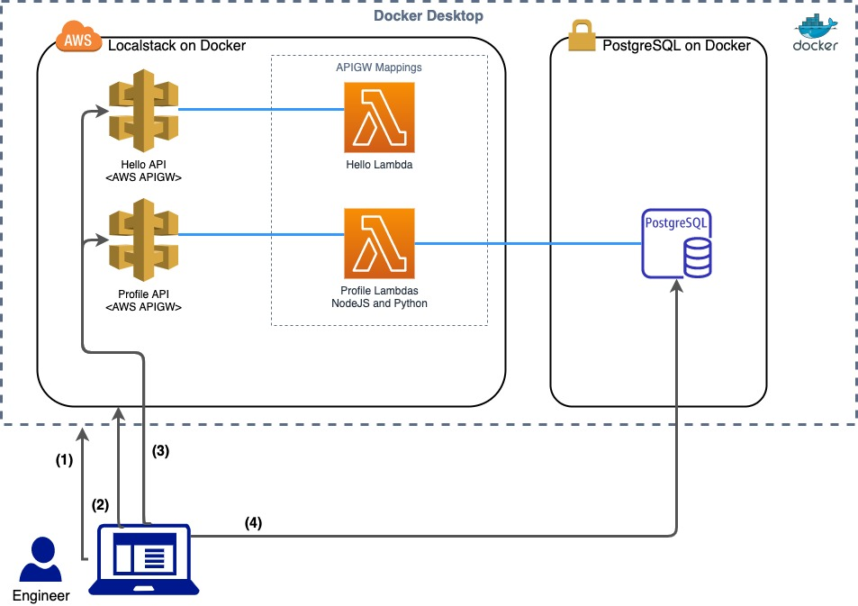

# Pulumi, API Gateway, Lambda, Localstack, Docker test example
Project to deploy an API Gateway with Lambda integration locally with localstack and Pulumi. We'll fully develop and test API Gateway REST endpoints and Lambdas locally before ever pushing to AWS.

#### Diagram
1. Deploy containers on Docker Desktop for Localstack and PostgreSQL
2. Deploy AWS services onto Localstack using Pulumi, some code you'd use to deploy to AWS
3. Run Jest tests. Tests create DB schema/tables, hit APIGWs
4. Tests assert data in DB is correct

### Setup

This BluePrint is done on a Mac so some of the instructions are Mac / Linux specific. It should be doable on a Windows machine also somehow.

1. Install Homebrew on your Mac. https://docs.brew.sh/Installation
2. Install Docker Desktop. https://www.docker.com/products/docker-desktop
3. Install NVM (node version manager). If you're on Windows, install the latest stable Node version. 
https://github.com/nvm-sh/nvm
4. Run these commands to install the latest node and use it
> nvm install node
> nvm use node
5. Install Yarn. 
> npm install --global yarn
6. Install AWS CLI. https://docs.aws.amazon.com/cli/latest/userguide/install-cliv2.html

### Configuration

1. Create the `.env` with the following variables:
```bash
export APP_NAME=bp-api
export REGION=us-east-1
export STAGE=bp.local
export STACK=${APP_NAME}-${STAGE}
export LS_VERSION=latest
```

To deploy to AWS just change the `STAGE` value to anything that doesn't end in `.local`

#### Login to pulumi locally to manage the project stack states on the local file system
To see more document on Pulumi backends, see this: https://www.pulumi.com/docs/intro/concepts/state/#backends
We're storing the pulumi state to the current directory you're in. A `.pulumi` directory will be created.
```
$ pulumi login file://`pwd`
```
#### In the terminal run the following commands
The project uses secrets. Set a pulumi project passphrase
`export PULUMI_CONFIG_PASSPHRASE=<choose some passphrase to encrypt project secrets>`

Install required packages
`$ make setup`  

Start localStack and PosgreSQL docker
`$ make up`


#### Deploy AWS Resources with Pulumi
Run `$ make deploy`
If you want to run `pulumi up` from the command line, you need to source the .env file. `source .env`

## Test the API
#### Install all Packages
```bash
yarn install
```

### Run all the tests
All test files end with `test.ts`. Go find them.
```bash
yarn test
```
### Destroy
Don't do this unless you want to completely start from scratch again. This deletes your pulumi stack and you'll have to start back at `make setup`.
Run `$ make destroy`

### Destroy pulumi stack, recreate it, redeploy
Delete stack, stop Docker containers, cleanup Docker.
`make redo`
Deploy the services
`make deploy`

## Developer SDLC
The developer Software Development LifeCycle is the ecosystem the developer is operating in and the workflows they can perform. The better the ecosystem, the faster the developer worksflows can be run, maximizing developer velocity.
###  Change a Lambda function
Let's assume you have the system running. Let's change a Python Lambda
1. Open a Lambda function. `src/profile/lambda/python/get_profile_by_id.py`
2. You see that this references the Profile class that's what you really want to change to add some more error handling or something. `src/profile/lambda/python/lib42/db_util.py`
3. Update unit tests in `src/test/db-api.test.ts`
4. Run `make deploy` to deploy the new Lambda
5. Run `yarn test` to run all the unit tests


### Add route to the REST API and new Lambda
This Blueprint uses AWS API Gateway Version 1 because I want to be able to quickly switch between API Gateway types regional, edge, and private.
Every REST operation needs 
- resource to hit. We're creating a Lambda
- give APIGW permission to invoke the Lambda
- APIGW needs a resource (URI path), HTTP Method, and Integration
- good automated tests
This is where to do all of that in this project.
1. Let's create a Python Lambda. See the `src/profile/lambda/python/get_profile_by_id.py` file and how it defines a Lambda. Also the `makefile` in that the root directory and the `src/profile/lambda/python` directory handle packaging the Lambda into a zip file inside a Docker container targeted to the Python 3.8 runtime.

Now we're going to modify the Pulumi Typescript resource definitions in `src/profile/profileApi.ts`
2. Define the Lambda Function. See examples around line 105. Every resource must have a unique name.
```
const getProfilePythonLambda = new aws.lambda.Function(
    `${NAME}-${apiName}-get-profile-python`,
    {
        runtime: aws.lambda.Python3d8Runtime,
        code: new pulumi.asset.FileArchive("./src/profile/lambda/python/build/get_profile_by_id.zip"),
        timeout: 15,
        handler: "get_profile_by_id.handler",
        role: lambdaRole.arn,
        environment: envvars,
    },
    { provider: PulumiUtil.awsProvider, }
);
```
3. Give APIGW permission to invoke the Lambda. See example around line 168.
```
let invokeGetPythonPermission = new aws.lambda.Permission(
    `${NAME}-${apiName}-get-python-byid`,
    {
        action: "lambda:invokeFunction",
        function: getProfilePythonLambda.name,
        principal: "apigateway.amazonaws.com",
        sourceArn: pulumi.interpolate`${restApi.executionArn}/*/*`,
        // qualifier: lambdaAlias.name,
    },
    { 
        dependsOn: [getProfilePythonLambda],
        provider: PulumiUtil.awsProvider, }
);
```
4. Add resource path, method, and integration. See example around line 284.
```
// ------------------ Start GetProfile Python Setup --------------
//
// GetProfile APIGW config
// PATH: /profile/python
const getProfilePythonResourceBase = new aws.apigateway.Resource(
    `${NAME}-${apiName}-get-python-base-profile`,
    {
        restApi: restApi,
        pathPart: 'python',
        parentId: createProfileResource.id,
    },
    { provider: PulumiUtil.awsProvider, }
);
// PATH: /profile/python/{profileId}
const getProfilePythonResource = new aws.apigateway.Resource(
    `${NAME}-${apiName}-get-python-profile`,
    {
        restApi: restApi,
        pathPart: `{profileId}`,
        parentId: getProfilePythonResourceBase.id,
    },
    { provider: PulumiUtil.awsProvider, }
);
//
// GetProfile Python Method
//
const getProfilePythonMethod = new aws.apigateway.Method(
    `${NAME}-${apiName}-get-python-profile-get`,
    {
        restApi: restApi,
        resourceId: getProfilePythonResource.id,
        httpMethod: "GET",
        authorization: "NONE",
    },
    { provider: PulumiUtil.awsProvider, }
);
//
// GetProfile Python RestApi Lambda Integration
//
const getProfilePythonInteg = new aws.apigateway.Integration(
    `${NAME}-${apiName}-get-python-profile`,
    {
        restApi: restApi,
        resourceId: getProfilePythonResource.id,
        httpMethod: getProfilePythonMethod.httpMethod,
        type: "AWS_PROXY",
        integrationHttpMethod: "POST",
        passthroughBehavior: "WHEN_NO_MATCH",
        uri: pulumi.interpolate`arn:aws:apigateway:${AwsUtil.region}:lambda:path/2015-03-31/functions/${getProfilePythonLambda.arn}/invocations`
    },
    {
        dependsOn: [getProfilePythonMethod],
        provider: PulumiUtil.awsProvider,
    }
);
```
5. Create tests that hit the APIGW endpoint and assert results.
See `src/test/db-api.test.ts`
Run `yarn test` until your tests pass. 

## Misc 
### After you reboot
The Docker containers are not running and you've lost all your Localstack deployed resources.
Login to Pulumi backend.
```pulumi login file://`pwd` ```
Set your Pulumi project passphrase. The one you use for this project.
`export PULUMI_CONFIG_PASSPHRASE=<choose some passphrase to encrypt project secrets>`
Wipe out the pulumi state and start the Docker containers
`make redo`
Deploy your resources again
`make deploy`

### Login to PostgreSQL DB
If you want to get onto the PostgreSQL docker instance, you can do the following.
```bash
docker-compose run database bash
```

### Tailing Lambda Logs on Localstack
Export some fake AWS Credentials
`source testcreds.sh`
Get Lambda names
```
aws --endpoint-url=http://localhost:4566 lambda list-functions
```
Tail Lambda Log in real-time
```
aws --endpoint-url=http://localhost:4566 logs tail /aws/lambda/<Lambda name> --follow
```
There's also a convenient make target to tail the createProfile Lambda log
`$ make lambda-log`
And
`$ make lambda-log-get`


